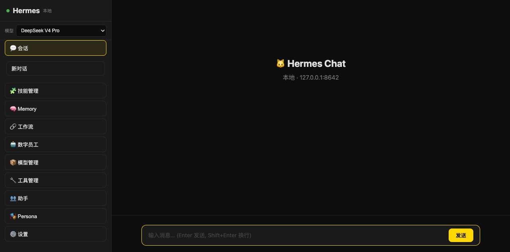
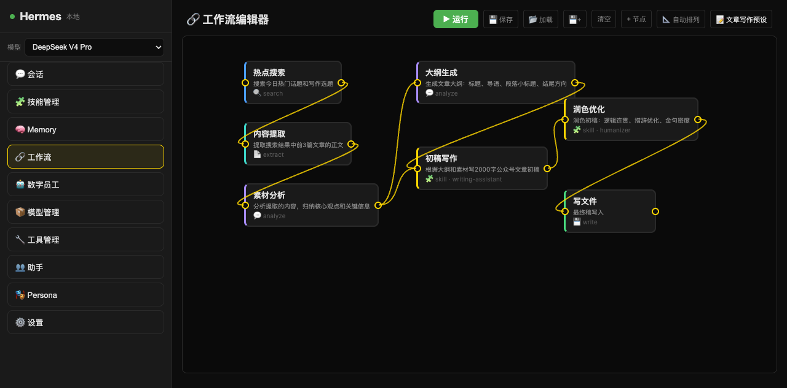
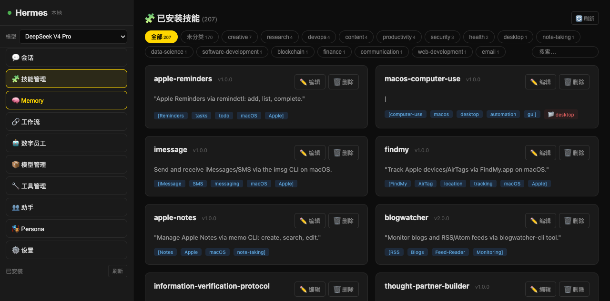
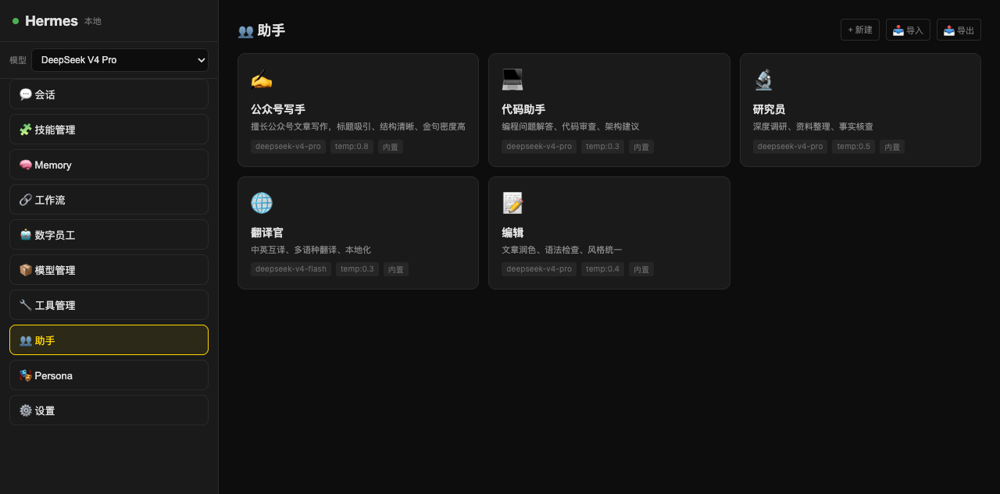
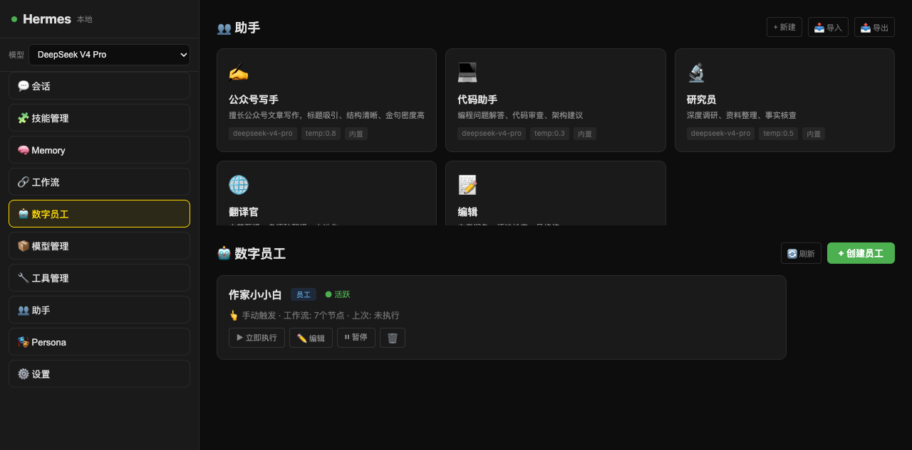
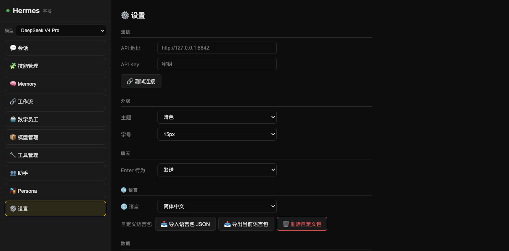

# Hermes Chat

<p align="center">
  <b>One HTML file. Full control of your AI agent.</b>
</p>

<p align="center">
  
  
  
</p>

## Screenshots

| Chat | Workflow |
|------|----------|
|  |  |

| Skills | Assistants |
|--------|------------|
|  |  |

| Digital Workers | Settings |
|----------------|----------|
|  |  |

---

Hermes Chat is a lightweight web GUI for [Hermes Agent](https://github.com/NousResearch/hermes-agent). Unlike Electron-based alternatives that weigh 500MB+, Hermes Chat is **a single HTML file + a Python proxy**. Zero npm, zero Docker, zero Electron.

---

## Why Hermes Chat?

| | Hermes Chat | hermes-desktop | Cherry Studio |
|---|---|---|---|
| Size | **2 files, ~280KB** | 500MB+ (Electron) | 400MB+ (Electron) |
| Install | `python3 server.py` | Installer + deps | Installer + deps |
| Workflow Editor | ✅ **Visual DAG** | ❌ | ❌ |
| Digital Workers | ✅ **Cron + Review** | ❌ | ❌ |
| Parallel Execution | ✅ | ❌ | ❌ |
| Conditional Branching | ✅ | ❌ | ❌ |
| Custom Assistants | ✅ 5 built-in | ❌ | ✅ 300+ |
| Undo/Redo | ✅ Ctrl+Z/Y | ❌ | ❌ |
| Open Source | ✅ MIT | ✅ MIT | ✅ AGPL |

---

## Quick Start

```bash
# 1. Make sure Hermes Agent is running on http://127.0.0.1:8642
# 2. Start Hermes Chat
export HERMES_API_KEY="your-hermes-api-key"
python3 hermes-chat-server.py

# 3. Open http://localhost:8080
```

Or one-liner:
```bash
HERMES_API_KEY="sk-xxx" python3 hermes-chat-server.py
```

---

## Features

### 💬 Chat
- Streaming responses with Markdown rendering
- Multi-model switching (DeepSeek, Qwen, etc.)
- Session history with SQLite search
- Slash commands (`/model`, `/web`, `/code`, etc.)

### 🔗 Visual Workflow Editor
- Drag-and-drop DAG nodes
- SVG Bézier connection lines
- **7 action types**: Search, Extract, Analyze, Write, Terminal, Skill, Custom
- **Parallel execution**: independent nodes run simultaneously
- **Conditional branching**: `if:output.length>0` on connection labels
- **Undo/Redo**: Ctrl+Z / Ctrl+Y
- **Resume from node**: right-click any node → "从此运行"
- Variable system: `{{node.3.output}}` cross-node references

### 🤖 Digital Workers
- Assign workflows to workers
- Manual trigger or cron schedule
- Admin review/approve workflow
- Automatic execution + result archiving

### 👥 Assistants
- 5 built-in: Writer, Coder, Researcher, Translator, Editor
- Each with custom system prompt, model, temperature
- One-click activation — model auto-switches
- Import/export as JSON

### 🧠 Memory & Skills
- View/edit/delete Hermes memory entries
- Browse 200+ skills with category filter
- Inline skill content editing

### 🎨 UI
- Dark/Light theme
- Language: Chinese / English + custom packs
- Panel transition animations
- Node color coding by action type
- Auto-layout with equal spacing

---

## Architecture

```
Browser (hermes-chat.html)
    ↓ HTTP :8080
Python Proxy (hermes-chat-server.py)
    ↓ HTTP :8642  
Hermes Agent → DeepSeek/Qwen/etc.
```

- `hermes-chat.html` — 100% vanilla JS, zero framework, single file
- `hermes-chat-server.py` — Python stdlib only (http.server + urllib)

---

## Requirements

- Python 3.9+
- [Hermes Agent](https://github.com/NousResearch/hermes-agent) running locally or remotely
- A modern browser

---

## License

MIT © 2025

---

## Roadmap

- [ ] Workflow template marketplace
- [ ] Webhook triggers
- [ ] Node minimap
- [ ] Drag-to-select multiple nodes
- [ ] Sub-workflow embedding
